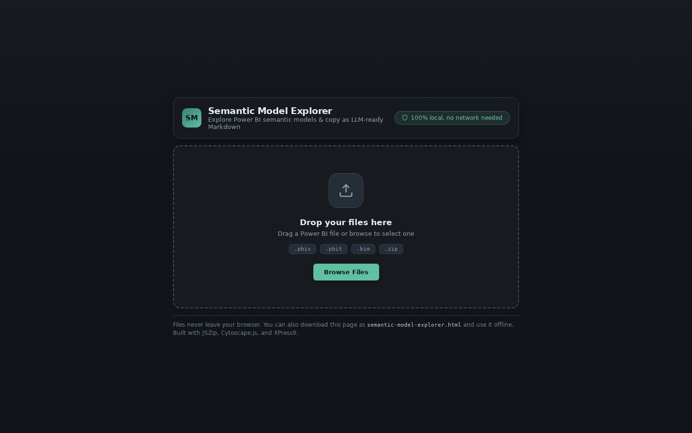
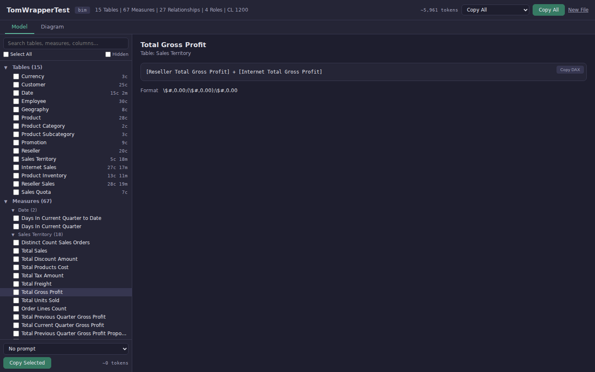
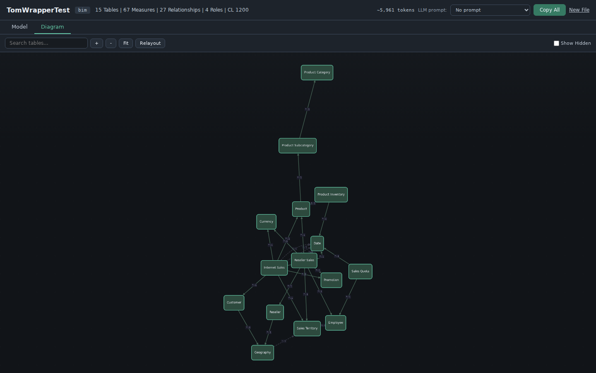
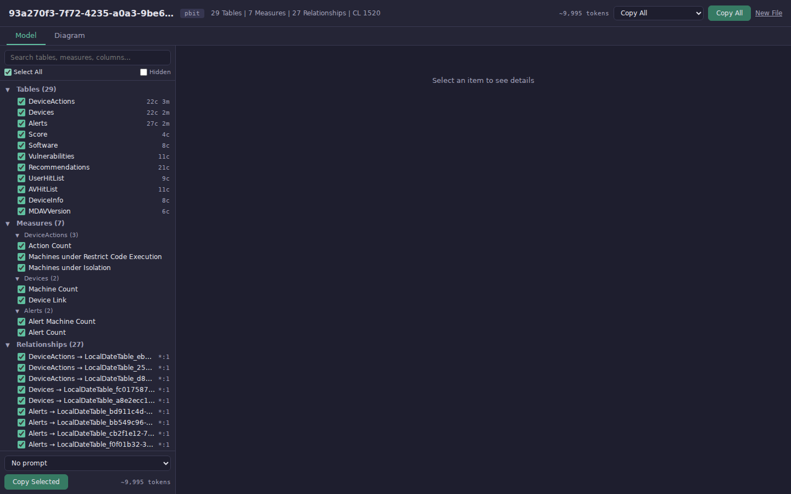
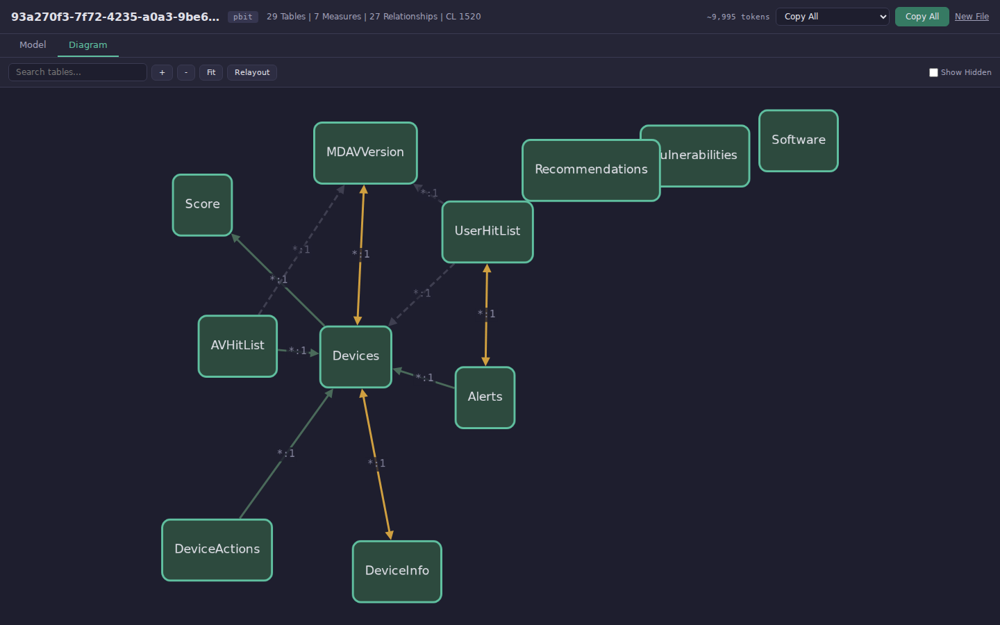
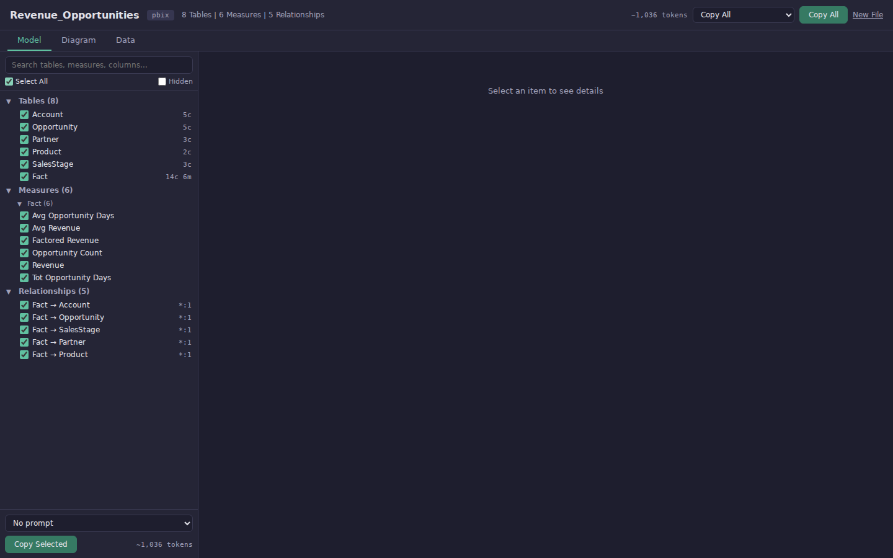

# Semantic Model Explorer

A single-file browser app for exploring Power BI semantic models and copying them as LLM-ready Markdown. Drop a file, explore the model, and paste it into ChatGPT / Claude / Copilot.

Live site: https://lczanna.github.io/semantic-model-explorer/

**No install. No server. No data leaves your browser.**



## Features

### Model Tab

Browse tables, columns, measures, relationships, and roles in a tree panel. Click any item to see its details, including DAX expressions with syntax highlighting and format strings.


Select what to include, pick an optional LLM prompt template, and copy structured Markdown to your clipboard with a token estimate.



### Diagram Tab

Interactive ER diagram powered by Cytoscape.js. Nodes are tables, edges are relationships with cardinality labels. Zoom, pan, search, and click any table or relationship for details.



### PBIT Support

Parses `.pbit` template files (ZIP with UTF-16LE encoded schema), including auto-generated date tables and all relationships.





### PBIX Data Extraction

Full `.pbix` support with VertiPaq data extraction via XPress9 WASM decompression. Browse the model metadata just like `.bim` files, plus extract actual table row data through the **Data tab**.



Preview data, then export to **CSV** or **Parquet**. Internal tables (H$, R$, U$, auto-date) are automatically filtered out. Extraction streams column-by-column so the UI stays responsive even with large tables.


## Supported Formats

| Format | Extension | Description |
|--------|-----------|-------------|
| BIM/TMSL | `.bim` | Tabular Model Scripting Language JSON |
| PBIT | `.pbit` | Power BI Template (ZIP with DataModelSchema) |
| TMDL | `.zip` | Tabular Model Definition Language (zipped folder) |
| PBIP | `.pbip` | Power BI Project (zipped) |
| PBIX | `.pbix` | Power BI file with full data extraction (XPress9 + VertiPaq) |

## Copy All Output

The **Copy All** button produces structured Markdown optimized for LLM consumption:

```markdown
# Model: AdventureWorks (CL 1200)
15 Tables | 67 Measures | 27 Relationships | 4 Roles

## Tables
### Internet Sales (27 columns, 17 measures)
| Column | Type | Description |
|--------|------|-------------|
| SalesOrderNumber | string | |
| OrderDate | dateTime | |
...

## Measures
### Internet Sales
#### Internet Total Sales
```dax
SUM('Internet Sales'[Sales Amount])
```
Format: \$#,0.00

## Relationships
| From | To | Cardinality | Cross-filter | Active |
|------|----|-------------|--------------|--------|
| Internet Sales[ProductKey] | Product[ProductKey] | *:1 | Single | Yes |
...

## Roles
### Read
| Table | Filter |
|-------|--------|
| Geography | [Country] = "US" |
```

Token estimates help plan LLM context window usage.

## Architecture

- **Single HTML file** (~716 KB) assembled from modular sources by `scripts/build.py`
- **Zero network requests** - works fully offline, strict CSP
- [JSZip](https://stuk.github.io/jszip/) for ZIP extraction (PBIT/TMDL/PBIP)
- [Cytoscape.js](https://js.cytoscape.org/) for the relationship diagram
- XPress9 WASM for .pbix DataModel decompression (VertiPaq columnar storage)
- [hyparquet-writer](https://github.com/hyparam/hyparquet) for Parquet export

### Build

```bash
python scripts/build.py
```

Assembles `src/` source files + `lib/` dependencies into `index.html`.

Inspired by [Power Query Explorer](https://github.com/lczanna/power-query-explorer).

## Development

### Run Tests

```bash
pip install playwright pytest pytest-playwright
python -m pytest scripts/run_tests.py -v --browser chromium
```

53 Playwright tests cover:
- **File parsing**: BIM, PBIT, TMDL, PBIX formats with generated and real-world files
- **Downloaded test files**: AdventureWorks.bim, AsPartitionProcessing.bim, MDATP_Status_Board.pbit, TMDL Sales model, Revenue_Opportunities.pbix, Corporate_Spend.pbix
- **PBIX data extraction**: VertiPaq decoding, Data tab UI, internal table filtering, CSV export, export button state
- **UI interactions**: tab switching, search, select all, detail panel, copy
- **Diagram rendering**: node/edge count, search filtering
- **Error handling**: invalid files, empty JSON
- **Cross-format consistency**: BIM and PBIT of the same model produce identical output
- **Parser internals**: JSON parsing, column filtering, cardinality mapping, token estimation

### Take Screenshots

```bash
python scripts/take_screenshots.py
```

### Generate Test Fixtures

```bash
python scripts/generate_test_files.py
```

## Test Files

Test files from Microsoft and community repos:

| File | Source | Contents |
|------|--------|----------|
| `AdventureWorks.bim` | [TabularEditor](https://github.com/TabularEditor/TabularEditor) | 15 tables, 67 measures, 27 relationships, 4 roles |
| `AsPartitionProcessing.bim` | [Microsoft Analysis Services](https://github.com/microsoft/Analysis-Services) | 9 tables, 21 measures, 13 relationships |
| `MDATP_Status_Board.pbit` | [Microsoft MDE-PowerBI-Templates](https://github.com/microsoft/MDE-PowerBI-Templates) | 29 tables, 7 measures, 27 relationships |
| `tmdl-sales/` | [Microsoft Analysis Services SamplePBIP](https://github.com/microsoft/Analysis-Services) | 11 tables with measures, relationships, calculation groups |
| `Revenue_Opportunities.pbix` | [Microsoft Power BI Samples](https://github.com/microsoft/powerbi-desktop-samples) | 8 tables, 6 measures, 5 relationships (with VertiPaq data) |
| `Corporate_Spend.pbix` | [Microsoft Power BI Samples](https://github.com/microsoft/powerbi-desktop-samples) | Multi-table model with VertiPaq data |

## License

MIT
